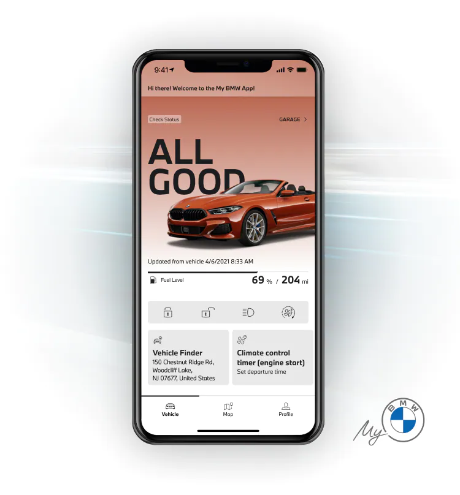

<h1 align="center">BMW-MVC-ATV1</h1>

 <h4 align="center"> Projeto BMW-MVC Senac🚀 Finalizado com sucesso ✨
  </h4>

 

ÍNDICE...

<a href="#sobre-o-projeto">Sobre</a> • 
<a href="#Imagem">Imagem</a> • 
<a href="#Tecnologias--">Tecnologias</a> • 
<a href="#Ferramentas">Ferramentas</a>

 

 
<h1 align="center">Imagem</h1>

<h1 align="center">
   
</h1>

<!--Sobre o projeto-->
<h2 align="center">💻 Sobre o projeto</h2>

<h3 align="center">Projeto de um site feito em .Net MVC da Bmw evolução do site principal da bmw atulamente privado no GitHUb</h3>

## Tecnologias

- [x] **HTML**
- [x] **CSS**
- [x] **JAVASCRIPT**
- [x] **SQL**

#### Ferramentas
- [**VS CODE**](https://code.visualstudio.com/)
- [**Bootstrap**](https://getbootstrap.com/)
- [**.NET**](https://dotnet.microsoft.com/en-us/)

<h4 align=center>Desenvolvido por Felipe Holanda <a href="https://www.linkedin.com/in/felipe-holanda-de-freitas-3a91281a2/"> <strong>Entre em contato</strong> :)</a></a></h4>

